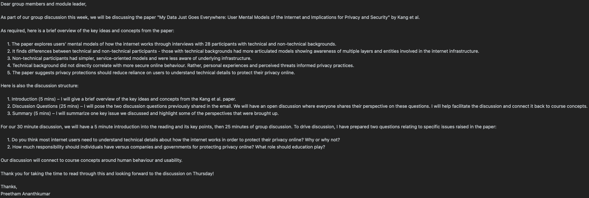

# "My Data Just Goes Everywhere: User Mental Models of the Internet and Implications for Privacy and Security" – Kang 2015

## Leader summary

Our group discussion focussed around the issue of who’s responsible for protecting online privacy, and this falls into the following categories: individuals, companies, or governments. This issue connects closely to the paper being analysed, Kang et al., which found a surprising correlation that a user’s technical knowledge did not necessarily predict the actions undertaken to improve their online privacy. Our conversation then raised important talking points about how to make users empowered, whilst also keeping big tech institutions accountable in terms of their data processing.

A point then was raised – how much should individual themselves have to burden to take steps in safeguarding their online privacy? Some members in the group argued that those who showed more technical prowess should take the time to proactively learn about threats and the relevant tools to protect themselves. Other members contested this, by saying that the average user without a technical background cannot grasp security concepts, let alone, have the necessary motivation to even learn about it. Such topics include subjects of encryption, network infrastructure or threat identification. Rather, some members came to the conclusion that companies themselves should implement robust privacy protections by default, than making the assumption that users, regardless of their technical knowledge, can properly manage their own privacy within a complex digital environment.

Certain members within the group also contented this notion however. Relying on companies’ privacy policies exclusively can pose its own set of issues. Concerns about how often terms and conditions are skipped and are unread by the typical user were voiced. Issues were found – relating to how the user does not change the default privacy settings and thus unintentionally opt in to features such as telemetry data being directly sent to companies. Another pointed out that this is not only the user’s fault, rather, companies themselves should invest effort and time into developing systems which are usable and meet, if not exceed, the standard usability guidelines. So relying on companies is not a sustainable long term solution and there is substantial evidence of it being insufficient already.

Our discussion came to the identification of balancing individual responsibility in combination with some sort of accountability for companies that are processing user data. Individuals can reasonable handle basic tools or take small steps for improving their online privacy; but only up to a certain extent. So to counteract this, companies must make their UI design as transparent as possible, especially when it comes to data flows and processing but not to hide it behind convoluted legislation pages, such as terms and conditions. Several people also advocated government regulations to set baselines to relieve some of the burden from individuals so companies hair no choice but to comply.

In conclusion, individuals should not have to master and go out of their way to learn about technical intricacies to protect their basic rights, but should be aware to some basic degree about the state of their online privacy. Again, we can neither except companies to regulate or self-police themselves, given the constantly present business incentives and company growth opportunities. A key takeaway we all agreed upon is that a usable design, full transparency when data processing is involved, education and more stricter regulation laws are all required. Users can then build their foundations or use specific tools that are tailored to their mental models, instead of technical expertise. Our discussion revealed how online privacy falls under the responsibility of both the individual and the company, but with a slight bias towards institutions. With both parties applying themselves to the conjoint goal of online privacy, there can be a mutual benefit.

# "Finding the weakest links in the weakest link: How well do undergraduate students make cybersecurity judgement?" – Yan 2018

## Member summary

# "Can Computers Become Conscious and Overcome Humans?" – Signorelli 2018

## Member summary

# Appendices

## Group leader email

